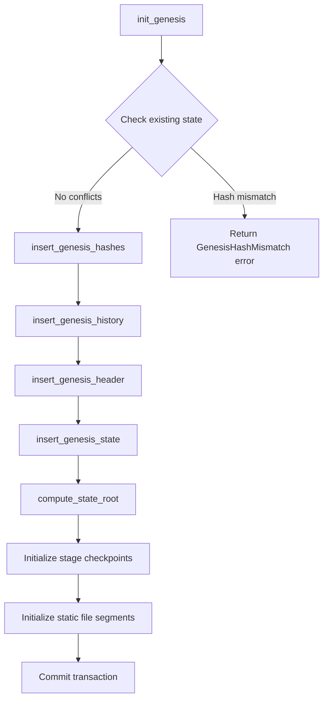
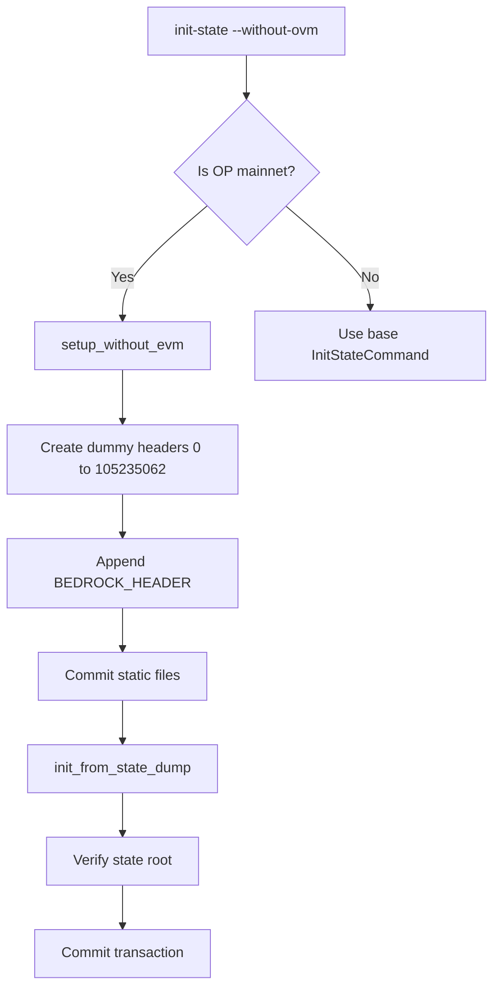

# Database

This document describes the reth database schema structure and how initial state is saved.

## Table of Contents

- [Abstractions](#abstractions)
- [Codecs](#codecs)
- [Table Layout](#table-layout)
- [Table Reference](#table-reference)
- [DupSort Tables](#dupsort-tables)
- [Initial State & Genesis Initialization](#initial-state--genesis-initialization)
- [Optimism-Specific Initialization](#optimism-specific-initialization)

## Abstractions

- We created a [Database trait abstraction](https://github.com/paradigmxyz/reth/blob/main/crates/cli/commands/src/db/mod.rs) using Rust Stable GATs which frees us from being bound to a single database implementation. We currently use MDBX, but are exploring [redb](https://github.com/cberner/redb) as an alternative.
- We then iterated on [`Transaction`](https://github.com/paradigmxyz/reth/blob/main/crates/storage/errors/src/db.rs) as a non-leaky abstraction with helpers for strictly-typed and unit-tested higher-level database abstractions.

## Codecs

- We want Reth's serialized format to be able to trade off read/write speed for size, depending on who the user is.
- To achieve that, we created the [Encode/Decode/Compress/Decompress traits](https://github.com/paradigmxyz/reth/blob/main/crates/storage/db-api/src/table.rs) to make the (de)serialization of database `Table::Key` and `Table::Values` generic.
  - This allows for [out-of-the-box benchmarking](https://github.com/paradigmxyz/reth/blob/main/crates/storage/db/benches/criterion.rs) (using [Criterion](https://github.com/bheisler/criterion.rs))
  - It also enables [out-of-the-box fuzzing](https://github.com/paradigmxyz/reth/blob/main/crates/storage/db-api/src/tables/codecs/fuzz/mod.rs) using [trailofbits/test-fuzz](https://github.com/trailofbits/test-fuzz).
- We implemented that trait for the following encoding formats:
  - [Ethereum-specific Compact Encoding](https://github.com/paradigmxyz/reth/blob/main/crates/storage/codecs/derive/src/compact/mod.rs): A lot of Ethereum datatypes have unnecessary zeros when serialized, or optional (e.g. on empty hashes) which would be nice not to pay in storage costs.
    - [Erigon](https://github.com/ledgerwatch/erigon/blob/12ee33a492f5d240458822d052820d9998653a63/docs/programmers_guide/db_walkthrough.MD) achieves that by having a `bitfield` set on Table "PlainState which adds a bitfield to Accounts.
    - [Akula](https://github.com/akula-bft/akula/) expanded it for other tables and datatypes manually. It also saved some more space by storing the length of certain types (U256, u64) using the [`modular_bitfield`](https://docs.rs/modular-bitfield/latest/modular_bitfield/) crate, which compacts this information.
    - We generalized it for all types, by writing a derive macro that autogenerates code for implementing the trait. It, also generates the interfaces required for fuzzing using ToB/test-fuzz:
  - [Scale Encoding](https://github.com/paritytech/parity-scale-codec)
  - [Postcard Encoding](https://github.com/jamesmunns/postcard)
  - Passthrough (called `no_codec` in the codebase)
- We made implementation of these traits easy via a derive macro called [`reth_codec`](https://github.com/paradigmxyz/reth/blob/main/crates/storage/codecs/derive/src/lib.rs) that delegates to one of Compact (default), Scale, Postcard or Passthrough encoding. This is [derived on every struct we need](https://github.com/search?q=repo%3Aparadigmxyz%2Freth%20%22%23%5Breth_codec%5D%22&type=code), and lets us experiment with different encoding formats without having to modify the entire codebase each time.

### Table layout

Historical state changes are indexed by `BlockNumber`. This means that `reth` stores the state for every account after every block that touched it, and it provides indexes for accessing that data quickly. While this may make the database size bigger (needs benchmark once `reth` is closer to prod), it provides fast access to the historical state.

Below, you can see the table design that implements this scheme:

```mermaid
erDiagram
CanonicalHeaders {
    u64 BlockNumber "PK"
    B256 HeaderHash "Value for CanonicalHeaders"
}
HeaderNumbers {
    B256 BlockHash "PK"
    u64 BlockNumber
}
Headers {
    u64 BlockNumber "PK"
    Header Data
}
BlockBodyIndices {
    u64 BlockNumber "PK"
    u64 first_tx_num
    u64 tx_count
}
BlockOmmers {
    u64 BlockNumber "PK"
    Header[] Ommers
}
BlockWithdrawals {
    u64 BlockNumber "PK"
    Withdrawal[] Withdrawals
}
Transactions {
    u64 TxNumber "PK"
    TransactionSigned Data
}
TransactionHashNumbers {
    B256 TxHash "PK"
    u64 TxNumber
}
TransactionBlocks {
    u64 MaxTxNumber "PK"
    u64 BlockNumber
}
Receipts {
    u64 TxNumber "PK"
    Receipt Data
}
Bytecodes {
    B256 CodeHash "PK"
    Bytes Code
}
PlainAccountState {
    Address Account "PK"
    Account Data
}
PlainStorageState {
    Address Account "PK"
    B256 StorageKey "PK"
    U256 StorageValue
}
AccountsHistory {
    B256 Account "PK"
    BlockNumberList BlockNumberList "List of transitions where account was changed"
}
StoragesHistory {
    B256 Account "PK"
    B256 StorageKey "PK"
    BlockNumberList BlockNumberList "List of transitions where account storage entry was changed"
}
AccountChangeSets {
    u64 BlockNumber "PK"
    B256 Account "PK"
    ChangeSet AccountChangeSets "Account before transition"
}
StorageChangeSets {
    u64 BlockNumber "PK"
    B256 Account "PK"
    B256 StorageKey "PK"
    ChangeSet StorageChangeSets "Storage entry before transition"
}
HashedAccounts {
    B256 HashedAddress "PK"
    Account Data
}
HashedStorages {
    B256 HashedAddress "PK"
    B256 HashedStorageKey "PK"
    U256 StorageValue
}
AccountsTrie {
    StoredNibbles Nibbles "PK"
    BranchNodeCompact Node
}
StoragesTrie {
    B256 HashedAddress "PK"
    StoredNibblesSubKey NibblesSubKey "PK"
    StorageTrieEntry Node
}
TransactionSenders {
    u64 TxNumber "PK"
    Address Sender
}
TransactionHashNumbers ||--|| Transactions : "hash -> tx id"
TransactionBlocks ||--|{ Transactions : "tx id -> block number"
BlockBodyIndices ||--o{ Transactions : "block number -> tx ids"
Headers ||--o{ AccountChangeSets : "each block has zero or more changesets"
Headers ||--o{ StorageChangeSets : "each block has zero or more changesets"
AccountsHistory }|--|{ AccountChangeSets : index
StoragesHistory }|--|{ StorageChangeSets : index
Headers ||--o| BlockOmmers : "each block has 0 or more ommers"
BlockBodyIndices ||--|| Headers : "index"
HeaderNumbers |o--|| Headers : "block hash -> block number"
CanonicalHeaders |o--|| Headers : "canonical chain block number -> block hash"
Transactions ||--|| Receipts : "each tx has a receipt"
PlainAccountState }o--o| Bytecodes : "an account can have a bytecode"
PlainAccountState ||--o{ PlainStorageState : "an account has 0 or more storage slots"
Transactions ||--|| TransactionSenders : "a tx has exactly 1 sender"

PlainAccountState ||--|| HashedAccounts : "hashed representation"
PlainStorageState ||--|| HashedStorages : "hashed representation"
```



## Table Reference

### Block Data Tables

| Table | Key | Value | Description |
|-------|-----|-------|-------------|
| `CanonicalHeaders` | `BlockNumber` | `HeaderHash` | Maps block numbers to header hashes for the canonical chain |
| `HeaderNumbers` | `BlockHash` | `BlockNumber` | Reverse lookup: block hash to block number |
| `Headers` | `BlockNumber` | `Header` | Stores block header data |
| `BlockBodyIndices` | `BlockNumber` | `StoredBlockBodyIndices` | Transaction range pointers (`first_tx_num`, `tx_count`) |
| `BlockOmmers` | `BlockNumber` | `StoredBlockOmmers` | Uncle/ommer headers (pre-merge) |
| `BlockWithdrawals` | `BlockNumber` | `StoredBlockWithdrawals` | Post-Shanghai withdrawal data |
| `HeaderTerminalDifficulties` | `BlockNumber` | `CompactU256` | **Deprecated**: Total difficulty tracking |

### Transaction Tables

| Table | Key | Value | Description |
|-------|-----|-------|-------------|
| `Transactions` | `TxNumber` | `TransactionSigned` | Canonical transaction bodies |
| `TransactionHashNumbers` | `TxHash` | `TxNumber` | Hash to transaction number lookup |
| `TransactionBlocks` | `TxNumber` | `BlockNumber` | Maps highest tx number in block to block number |
| `TransactionSenders` | `TxNumber` | `Address` | Pre-recovered transaction senders (optimization) |
| `Receipts` | `TxNumber` | `Receipt` | Transaction receipts |

### State Tables

| Table | Key | Value | DupSort SubKey | Description |
|-------|-----|-------|----------------|-------------|
| `PlainAccountState` | `Address` | `Account` | - | Current account state (nonce, balance, code_hash) |
| `PlainStorageState` | `Address` | `StorageEntry` | `B256` | Current storage slot values |
| `HashedAccounts` | `B256` | `Account` | - | Hashed account state for merklization |
| `HashedStorages` | `B256` | `StorageEntry` | `B256` | Hashed storage for merklization |
| `Bytecodes` | `B256` | `Bytecode` | - | Smart contract bytecode |

### History Tables

| Table | Key | Value | DupSort SubKey | Description |
|-------|-----|-------|----------------|-------------|
| `AccountsHistory` | `ShardedKey<Address>` | `BlockNumberList` | - | Block numbers where account changed |
| `StoragesHistory` | `StorageShardedKey` | `BlockNumberList` | - | Block numbers where storage slot changed |
| `AccountChangeSets` | `BlockNumber` | `AccountBeforeTx` | `Address` | Account state before block execution |
| `StorageChangeSets` | `BlockNumberAddress` | `StorageEntry` | `B256` | Storage state before block execution |

### Trie Tables

| Table | Key | Value | DupSort SubKey | Description |
|-------|-----|-------|----------------|-------------|
| `AccountsTrie` | `StoredNibbles` | `BranchNodeCompact` | - | Account trie branch nodes |
| `StoragesTrie` | `B256` | `StorageTrieEntry` | `StoredNibblesSubKey` | Storage trie nodes per account |
| `AccountsTrieChangeSets` | `BlockNumber` | `TrieChangeSetsEntry` | `StoredNibblesSubKey` | Account trie state before block |
| `StoragesTrieChangeSets` | `BlockNumberHashedAddress` | `TrieChangeSetsEntry` | `StoredNibblesSubKey` | Storage trie state before block |

### Pipeline & Metadata Tables

| Table | Key | Value | Description |
|-------|-----|-------|-------------|
| `StageCheckpoints` | `StageId` | `StageCheckpoint` | Sync progress per pipeline stage |
| `StageCheckpointProgresses` | `StageId` | `Vec<u8>` | Stage-specific progress data |
| `PruneCheckpoints` | `PruneSegment` | `PruneCheckpoint` | Pruning progress per segment |
| `VersionHistory` | `u64` | `ClientVersion` | Client version access history |
| `ChainState` | `ChainStateKey` | `BlockNumber` | Chain state (finalized/safe blocks) |
| `Metadata` | `String` | `Vec<u8>` | Generic key-value metadata storage |

## DupSort Tables

DupSort tables allow multiple values per key, optimizing storage for related data:

| Table | Key | SubKey | Value |
|-------|-----|--------|-------|
| `PlainStorageState` | Address | StorageKey (B256) | StorageEntry |
| `HashedStorages` | HashedAddress | HashedStorageKey | StorageEntry |
| `AccountChangeSets` | BlockNumber | Address | AccountBeforeTx |
| `StorageChangeSets` | BlockNumberAddress | StorageKey | StorageEntry |
| `StoragesTrie` | HashedAddress | NibblesSubKey | StorageTrieEntry |
| `AccountsTrieChangeSets` | BlockNumber | NibblesSubKey | TrieChangeSetsEntry |
| `StoragesTrieChangeSets` | BlockNumberHashedAddress | NibblesSubKey | TrieChangeSetsEntry |

## Initial State & Genesis Initialization

Genesis initialization writes the initial blockchain state to the database. This process is handled by the `init_genesis` function in [`crates/storage/db-common/src/init.rs`](https://github.com/paradigmxyz/reth/blob/main/crates/storage/db-common/src/init.rs).

### Genesis Initialization Flow



### Tables Written During Genesis

| Step | Tables Modified |
|------|-----------------|
| Hashes | `HashedAccounts`, `HashedStorages` |
| History | `AccountsHistory`, `StoragesHistory` |
| Header | `HeaderNumbers`, `BlockBodyIndices`, Static Files (Headers) |
| State | `PlainAccountState`, `PlainStorageState`, `Bytecodes` |
| Trie | `AccountsTrie`, `StoragesTrie` |
| Checkpoints | `StageCheckpoints` |

### State Dump Initialization

For large state imports (e.g., OP mainnet at Bedrock), the `init_from_state_dump` function handles streaming state from a file:

```rust
// Key constants for state dump processing
const DEFAULT_SOFT_LIMIT_BYTE_LEN_ACCOUNTS_CHUNK: usize = 1_000_000_000; // 1 GB chunks
const AVERAGE_COUNT_ACCOUNTS_PER_GB_STATE_DUMP: usize = 285_228;
```

**Process:**
1. Parse state root from dump file header
2. Stream accounts in chunks (default 1GB)
3. For each chunk:
   - Insert hashes (`HashedAccounts`, `HashedStorages`)
   - Insert history indices
   - Insert state (`PlainAccountState`, `PlainStorageState`)
4. Compute and verify state root
5. Update stage checkpoints

## Optimism-Specific Initialization

OP Stack chains have special initialization requirements handled in [`crates/optimism/cli/src/commands/init_state.rs`](https://github.com/paradigmxyz/reth/blob/main/crates/optimism/cli/src/commands/init_state.rs).

### OP Mainnet Bedrock Migration

When using `--without-ovm` flag for OP mainnet:



**Important Notes:**
- Do NOT import receipts/blocks before using `--without-ovm`
- The Bedrock header and hash are hardcoded for OP mainnet
- For other OP chains, pass a custom header via the base `InitStateCommand`
